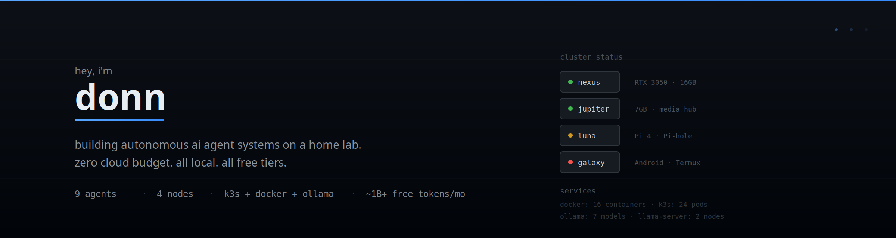
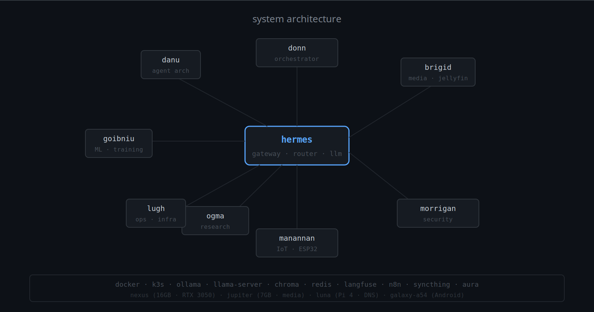

## what i'm building

autonomous ai agent systems on a home lab. no cloud budget. no enterprise infrastructure. just 4 nodes, free-tier apis, and a lot of stubbornness.

**tech duinn** (house of donn) is a multi-agent orchestration platform where 9 specialized agents coordinate across a distributed cluster — handling ml training, media pipelines, security, iot, research, and infrastructure operations.

## architecture



## the swarm

| agent | role | domain |
|-------|------|--------|
| **donn** | orchestrator | strategic coordination, resource allocation |
| **hermes** | gateway | llm routing, tool dispatch, inter-agent messaging |
| **brigid** | media | jellyfin, media pipeline, content management |
| **morrigan** | security | infrastructure auditing, threat modeling |
| **ogma** | research | knowledge base, ml research, paper curation |
| **lugh** | operations | devops, docker, k3s, infrastructure |
| **goibniu** | ml | model training, fine-tuning, gpu workloads |
| **danu** | architecture | agent framework design, skill development |
| **manannan** | iot | esp32 firmware, embedded systems, sensors |

## infrastructure

```
nexus (primary)     — RTX 3050 4GB · 16GB RAM · Ubuntu 26.04
jupiter (media)     — 7GB RAM · 234GB SSD · Docker services
luna (edge)         — Pi 4 · Pi-hole DNS · SearXNG
galaxy-a54 (mobile) — Android · Termux · intermittent
```

**stack:** docker · k3s · ollama · llama-server · chroma · redis · langfuse · n8n · syncthing · aura

**llm routing:** 13+ free-tier providers via openrouter with automatic fallback. ~1b+ tokens/month at zero cost.

## active projects

- [library-of-alexander](https://github.com/Danielhogben/library-of-alexander) — curated ai/ml/cs knowledge base
- [bonsai-brain](https://github.com/Danielhogben/bonsai-brain) — agent system optimized for 4gb vram
- [hermes-skills](https://github.com/Danielhogben/hermes-skills) — 130+ agent skills for hermes
- [hermes-agent](https://github.com/Danielhogben/hermes-agent) — hermes agent framework

## principles

1. **local first** — run it locally or don't run it at all
2. **free tiers only** — if it costs money, find another way
3. **self-healing** — the system fixes itself or alerts me
4. **minimal cloud** — tailscale mesh, no public exposure
5. **agents do the work** — i architect, they execute

---

📧 daniel.j.hogben@gmail.com · danhogben199@gmail.com
